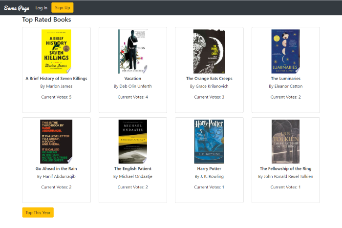

# Same Page
<https://salty-garden-60237.herokuapp.com/> \
Version 2.0 \
Version Deployment Date - Aug 09, 2020\
Updates By Jarrett Dougherty



## Guest User Login Info
```
username - samepageuser
password - samepagepassword
```

## Original Deployment
Code - <https://github.com/DominiqueGriffith/project_2> \
Version 1.0 \
Original Deployment Date - Aug 01, 2020 \
By Jarrett Dougherty, Lawrence Friedman, and Dominique Griffith 

## Description
Same Page is a full-stack application, originally created by a team, that allows users to search, recommend, and vote for books. The application uses Node.js, Express.js, and Sequelize. Data persistence is achieved with a MySQL database. The Google Books API is utilized via Axios. Express Handlebars is used for HTML templates and Bootstrap is used for the CSS framework. User accounts are secured with hashed passwords using Crypto. Express Session is used to ensure that only logged in users can access to site's main functions.

## Technologies Used
* JavaScript
* Node.js
* Express
* Express Handlebars
* Express Session
* Crypto
* Axios
* MySQL
* Bootstrap
* jQuery
* HTML
* CSS


## Personal Contributions
In the original version of Same Page, I was in charge of handling the Express Routes and much of the client-side JavaScript. I also created the User Sign Up and Login system. This system utilizes hashed passwords and extensive authentication, including session variables. For Version 2.0 I reworked some of the front-end (HTML, CSS, and Bootstrap classes) and altered the JavaScript to match the updated look.

## Instructions For Use
### Getting Started 
1. Simply click the link to start the web app.

<https://salty-garden-60237.herokuapp.com/>

2. Feel free to sign up as a new user or use the guest login info below.

```
username - samepageuser\
password - samepagepassword
```

3. Once logged in, the user can vote for the top books that are displayed. The books are presented in order of vote total and will automatically adjust as the vote totals change.

4. While logged in the user can also search for new books using the search field in the navbar. Search results will display and the user can add a book from the results to the 'Top Books'.

### GitHub Code
1. Once you have downloaded the program you will need to run the following command to install the required node packages.

```console
$ npm install
```

2. Create a MySQL database and table using the `schema.sql` commands. This file can be found in the `models` folder.

3. Next, create a file named `.env` at the root level, add the following to it, replacing the value ****** with your MySQL password:

```console
# mySQL password

password=******
```

4. An API key from [Google Books](https://developers.google.com/books/docs/v1/getting_started) is required to run the application locally.  You can add your API key to the `.env` file, replacing the value ****** with your key:

```console
# mySQL password

apiKey=******
```
5. You will then need to start the local server on the command line. Navigate to the local file and run the following code to start the server.

```console
$ node server.js
```

6. Once in the server is running, use a web browser to navigate to the following address. From here you can follow the directions in the application.

`localhost:3000`